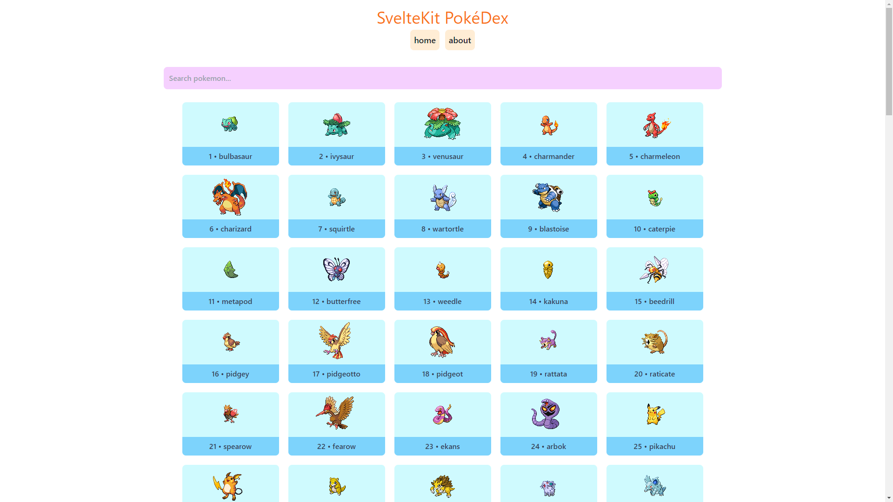
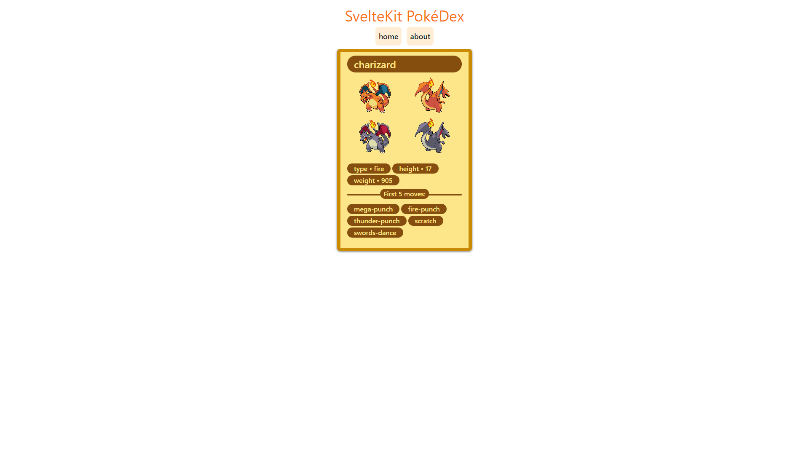
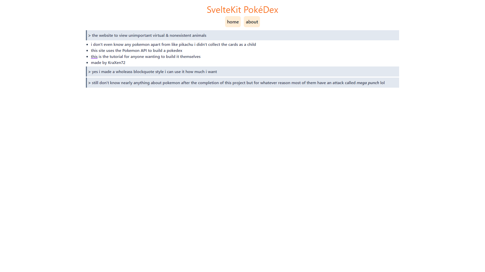

# sveltekit-pokedex
## uses:
- `pokeapi.co/api/v2`
- sveltekit
- typescript
- tailwindcss in jit mode

## screenshots:
  
  
  
  
## other stuff
- it was built kinda following [this](https://www.youtube.com/watch?v=UU7MgYIbtAk) tutorial on yt
- i made this mostly just to familiarize myself with sveltekit but might aswell throw it on github ok
- too lazy to host it anywhere like vercel or heroku if you really need this in your life lmk i'll host it on vercel
- i hate tailwindcss kinda but atleast i made it look better than James' version in the video so 🤷‍♂️
  